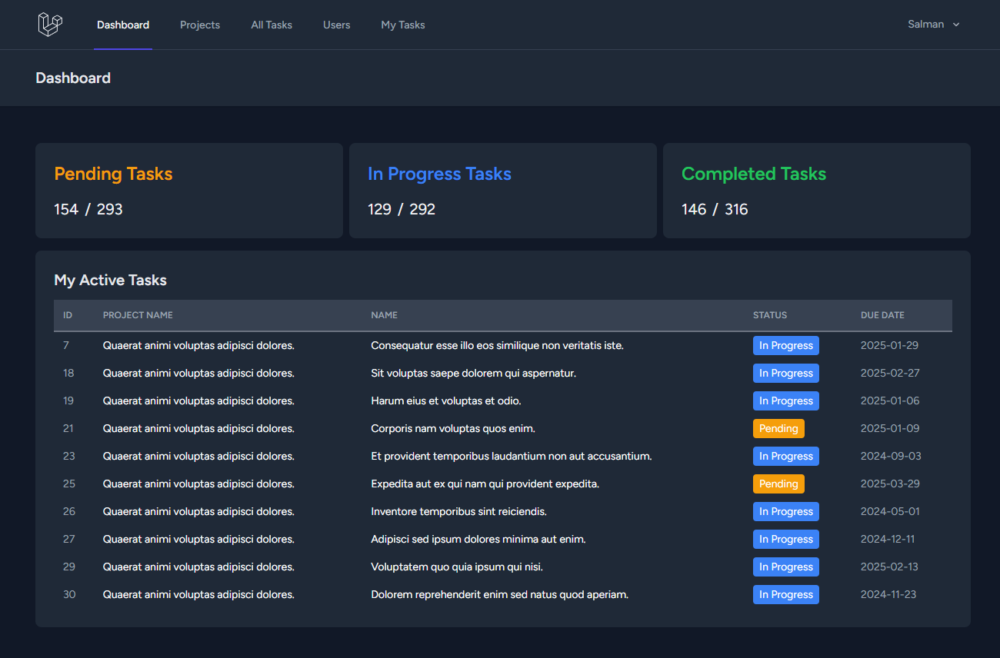
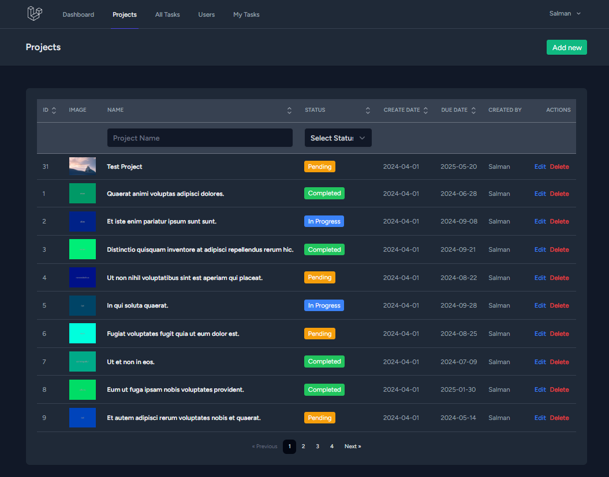
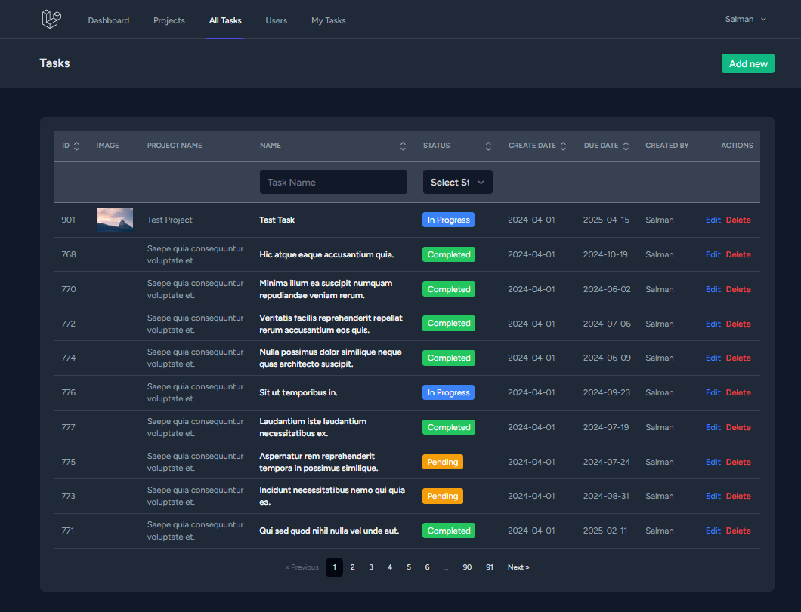

# Laravel 11 + React + Inertia: SPA Project for Learning and Exploration

**This project serves as a playground for experimenting with the latest features in Laravel 11, focusing on building a single-page application (SPA) using React and Inertia.js. It's not intended for production use.**

This project provides a hands-on environment for developers to:

-   Explore the capabilities of Laravel 11 in crafting modern SPAs.
-   Gain experience with React and Inertia.js for building interactive user interfaces.
-   Experiment with features like user authentication, CRUD operations, task management, and project organization.

**Key Functionalities:**

-   **User Authentication:** Implement registration and login functionalities for user management.
-   **Project Management:**
    -   Create, view, update, and delete projects (CRUD operations).
    -   Organize tasks within projects.
    -   Employ sorting, filtering, and pagination for efficient project management.
-   **Task Management:**
    -   Create, view, update, and delete tasks (CRUD operations).
    -   Assign users to specific tasks.
    -   View personally assigned tasks.
    -   Utilize sorting, filtering, and pagination for effective task organization.
-   **Informative Dashboard:**
    -   Visualize key project and task information at a glance, aiding project oversight.

**Project Preview:**

Get a glimpse of the project's functionalities through the provided screenshots:

-   **Dashboard Overview:**
    
-   **Projects Management:**
    
-   **Task Management:**
    

**Getting Started (Development Environment Setup):**

To delve into this project, follow these installation steps:

1. **Clone the Project:**

    ```bash
    git clone https://github.com/salscoding/laravel11-reactjs-inertia.git

    ```

2. **Project Root Navigation:**

    ```bash
    cd your-project-name

    ```

3. **Create .env File:**

    ```bash
    cp .env.example .env

    ```

4. **Install Dependencies:**

    ```bash
    composer install
    npm install

    ```

5. **Generate Application Key:**

    ```bash
    php artisan key:generate --ansi

    ```

6. **Run Migrations and Seed Data:**

    ```bash
    php artisan migrate --seed

    ```

7. **Start Vite Server:**

    ```bash
    npm run dev

    ```

8. **Start Artisan Server**
    ```bash
    php artisan serve
    ```

**License MIT**

Special Thanks to @thecodeholic
